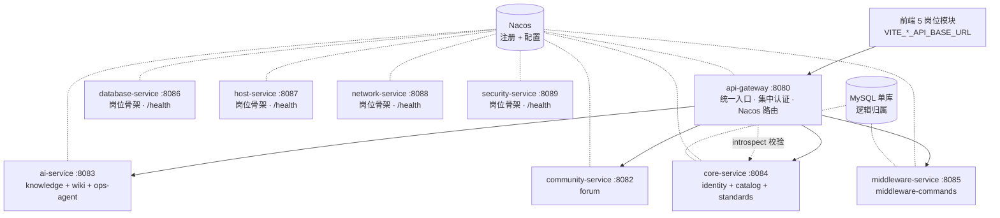
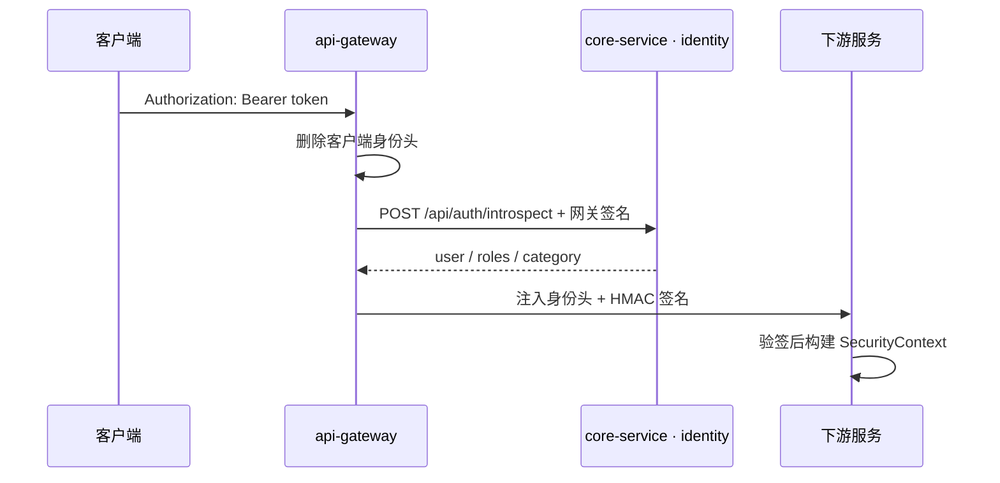

# 后端微服务化 · 全景与备忘

> 集成中心门户后端按平台能力与岗位边界拆分后的总览。各阶段详细说明见 `docs/microservices-split-plan.md` 与 `docs/microservices-stage*.md`。

## 概览

| 指标 | 值 |
|------|----|
| 可部署单元 | 9（网关 + 3 个平台能力服务 + 5 个岗位服务） |
| Maven Reactor 项目 | 26 |
| 测试 | 134 · 全绿 |
| 业务端点 | 148 · 路径、鉴权、SQL 不变 |
| DB / 前端改动 | 0 |

运行时为 9 个 Java 进程 + 单 MySQL（共享库 + 逻辑归属，二期再物理拆库）。`app` 已在阶段 6 退役。

## 服务拓扑

database/host/network/security-service 当前没有业务路径，只在 `cloud` profile 注册 Nacos，不配置网关路由。新增业务端点时必须使用精确路径增加路由，禁止恢复 `/api/**` 兜底路由。

## 服务职责 / 端点 / 数据归属

| 服务 | 端口 | 职责 | 主要对外端点 | 数据表 |
|------|------|------|------|------|
| **api-gateway** | 8080 | 统一入口、集中认证、路由 | `/api/**`（按精确规则转发） | - |
| **community-service** | 8082 | 论坛社区 | `/api/forum/**` | forum_* |
| **ai-service** | 8083 | 知识库 RAG、Wiki、Zabbix Agent | `/api/knowledge/**` `/api/agent/**` `/api/wiki/**` `/api/ops-agent/**` | knowledge_*、wiki_*、agent_tool_invocations |
| **core-service** | 8084 | 身份、资源目录、标准 | `/api/auth/**` `/api/admin/**` `/api/public/**` `/files/**` | admin_accounts、roles、user_tokens、catalog/standards 相关表 |
| **middleware-service** | 8085 | 中间件岗位专属命令、按名导入导出 | `/api/middleware-commands/**` | middleware_commands；通过 SoftwareTypeLookup 调 catalog |
| **database-service** | 8086 | 数据库岗位骨架 | 直连 `/health`，暂无网关业务路由 | 暂无专属表 |
| **host-service** | 8087 | 主机岗位骨架 | 直连 `/health`，暂无网关业务路由 | 暂无专属表 |
| **network-service** | 8088 | 网络岗位骨架 | 直连 `/health`，暂无网关业务路由 | 暂无专属表 |
| **security-service** | 8089 | 网络安全岗位骨架 | 直连 `/health`，暂无网关业务路由 | 暂无专属表 |

## 集中认证流

所有服务复用 `common-security` 与 `common-web`。`GATEWAY_SIGNING_SECRET` 必须由环境变量提供且至少 32 UTF-8 字节，配置文件不提供真实默认值。

## 共享基础库

| 库 | 内容 |
|----|------|
| `common-core` | DTO、错误码、共享模型、跨模块端口契约 |
| `common-security` | 网关身份头验签、HMAC、岗位(category)权限模型 |
| `common-web` | SecurityConfig、访问日志、审计、全局异常处理；公开 `/health` |

## 拆分历程

| 阶段 | 内容 | 状态 |
|------|------|------|
| 0 | 模块化单体 | 已完成 |
| 1 | api-gateway + Nacos 地基 | 已完成 |
| 2 | 剥离 community-service | 已完成 |
| 3 | 剥离 ai-service | 已完成 |
| 4 | 剥离 core-service | 已完成 |
| 5 | 网关集中认证 | 已完成 |
| 6 | 5 个岗位服务独立部署，app 退役 | 已完成 |
| 7 | 物理拆库、可观测性、完整预发集成 | 待实施 |

## 关键不变量

- 9 个可执行 JAR：api-gateway、core-service、ai-service、community-service 与 5 个岗位服务，无 app。
- `/api/middleware-commands` 的既有查询行为保持不变；类型解析改由 middleware-service 通过签名内部 API 调用 core-service catalog，导入导出仅系统管理员可用。
- 148 个业务端点保持不变；四个 `/health` 是运维端点，不计入业务端点集合。
- 默认 profile 所有服务关闭 Nacos；只有 `cloud` profile 注册和读取 Nacos 配置。
- 服务间零编译依赖；部署服务只依赖 `common-*` 与自身能力模块。
- 仓库不存真实密钥。DB、Nacos、AI、Zabbix 与网关签名凭据均通过环境变量注入。

## 常用命令与软件类型/分类（阶段6 后）

- `middleware_commands` 改挂 **catalog 的 `software_type_id`**（逻辑关联，无物理外键）；独立 `middleware_types` 迁入 `software_types`（归“中间件”分类）后淘汰。命令级 `categories` 标签保留。
- 跨服务：middleware-service 经 catalog 的**内部软件类型 API**（`InternalSoftwareTypeApiController`，`resolveOrCreate` 等，均以网关 HMAC 签名鉴权、外部无签名→403）解析/落地类型，catalog 保持对 `software_types` 的写入权，不跨库写。
- **数据迁移（test→prod）**：管理端 `GET /api/middleware-commands/export`（按分类名/类型名导出，无自增 ID）+ `POST /api/middleware-commands/import`（按名解析、幂等 upsert）。详见 `docs/middleware-commands-software-type-migration.md`。

## 后续待办

- 注册 GitLab Runner，并补全 `integration:e2e` 的真实 Nacos/MySQL 多进程验证。
- 按服务物理拆库，建立跨服务事件与对账机制。
- 引入 OpenTelemetry 指标、日志与链路追踪。
- database/host/network/security 岗位新增业务端点时补精确网关路由、鉴权和契约测试。
