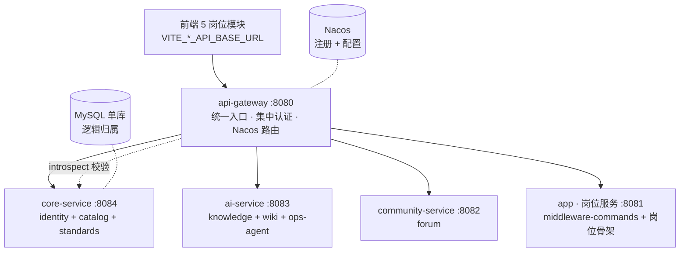
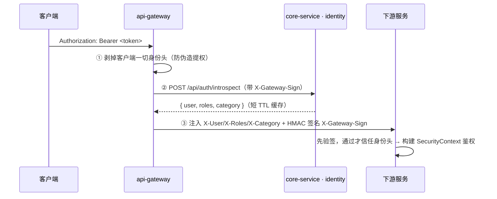

# 后端微服务化 · 全景与备忘

> 中间件资源管理平台后端按**岗位边界**拆分为微服务的总览、关键决策与待办。
> 交互版全景图（可视化，私有 artifact）：<https://claude.ai/code/artifact/74a097a9-a97e-401a-826b-b2ab54fca570>
> 各阶段详细说明见 `docs/microservices-split-plan.md` 与 `docs/microservices-stage*.md`。

## 概览

| 指标 | 值 |
|------|----|
| 可部署单元 | 6（网关 + 5 服务） |
| Maven 模块 | 22 |
| 测试 | 126 · 全绿 |
| 业务端点 | 148 · 逐字不变 |
| DB / 前端改动 | 0 |

运行时仍是**单进程集合 + 单 MySQL**（共享库 + 逻辑归属，二期再物理拆库）；行为与拆分前逐字一致。

## 服务拓扑

## 服务职责 / 端点 / 数据归属

| 服务 | 端口 | 职责 | 主要对外端点 | 数据表 |
|------|------|------|------|------|
| **api-gateway** | 8080 | 统一入口 · 集中认证 · 路由（无业务表） | `/api/**`（转发） | — |
| **core-service** | 8084 | 平台核心：身份 + 资源目录 + 标准（identity+catalog+standards） | `/api/auth` `/api/admin/users\|account\|settings` `/api/admin/releases\|software-types` `/api/admin/parameter-standards\|standard-documents\|reviews` `/api/public/*` | admin_accounts, roles, user_tokens, system_settings, api_audit_log, software_types, release_assets, parameter_standards, standard_documents, review_records … |
| **ai-service** | 8083 | AI/Agent 集群：知识库 RAG + Wiki + Zabbix Agent | `/api/knowledge` `/api/agent` `/api/wiki` `/api/ops-agent(/export)` | knowledge_chunks, chat_sessions, chat_messages, wiki_*, agent_tool_invocations |
| **community-service** | 8082 | 论坛社区 | `/api/forum` | forum_posts, forum_comments, forum_tags, forum_post_likes, forum_post_tags |
| **app · 岗位服务** | 8081 | 岗位专属能力（对齐前端 5 岗位） | `/api/middleware-commands` | middleware_commands, middleware_types |

**专属重依赖**：Milvus / LangChain4j / Apache POI 归 ai-service（已从单体移出）。

## 集中认证流

**安全护栏**：网关剥客户端头（防伪造）· 下游验 HMAC 签名（防绕网关直连）· introspect 仅认网关签名（否则 403）· `GATEWAY_SIGNING_SECRET` ≥32 字节纯环境变量。

## 共享基础库

| 库 | 内容 |
|----|------|
| `common-core` | DTO · 错误码 · 跨模块端口契约（SoftwareTypeLookup / AccountDirectory 等） |
| `common-security` | 网关头信任 Filter · HMAC 签名服务 · 岗位(category)权限模型 |
| `common-web` | 过滤器 · 全局异常 · SecurityConfig 路径规则（逐字未改） |

## 拆分历程（strangler-fig）

| 阶段 | 内容 | 状态 |
|------|------|------|
| 0 | 模块化单体（Maven 多模块，261 rename、0 内容改动） | ✅ |
| 1 | api-gateway + Nacos 地基（默认 profile 不依赖 Nacos） | ✅ |
| 2 | 剥离 community-service | ✅ |
| 3 | 剥离 ai-service（Milvus/LangChain4j 移出单体） | ✅ |
| 4 | 剥离 core-service（app 变为岗位服务） | ✅ |
| 5 | 网关集中认证（多语言开关；角色权限归 identity） | ✅ |
| CI | 按路径触发的 monorepo 流水线（`.gitlab-ci.yml`，Lint 通过） | ✅ |

节奏：写规格 → codex(gpt-5.6-sol/xhigh) 实现 → 独立验收 → 推分支，全部累积在 `refactor/backend-modular-monolith`（MR !6 Draft）。

---

## 备忘 · 关键决策与不变量

- **仓库/分支**：`zhugl/middleware_resource_manager` · `refactor/backend-modular-monolith`（MR !6 Draft，改造完成再合并 master）。
- **部署**：**jar + systemd** 上 VM（非容器）。起停顺序 Nacos → core-service → 其余服务 → api-gateway。
- **数据**：单 MySQL（共享库 + 逻辑归属）；**服务间禁跨库 join**，只走 API/事件；二期再 db-per-service。
- **认证**：网关校验 token（调 core 的 `/api/auth/introspect`）+ 剥客户端头 + 注入 HMAC 签名身份头；下游**验签才信任**；`GATEWAY_SIGNING_SECRET` ≥32 字节、纯环境变量。
- **构建**：服务间**零编译依赖**（只依赖同仓 `common-*`）；单服务构建用 `mvn -pl <svc> -am`；`common-*` 变更扇出全建。
- **不变量**：148 业务端点 / SQL / SecurityConfig **逐字未改**；126 测试全绿。
- **版本**：Spring Boot 3.5 · Java 17 · Spring Cloud 2025.0.0 + Spring Cloud Alibaba 2025.0.0.0。
- **🔴 安全**：仓库历史曾提交**真实密钥**（DB 密码 / AI Key 等）；最新文件已止血为环境变量，但**历史与公开镜像未清洗** → 必须在源头**轮换**。

## TODO

### 🔴 优先 / 仅负责人可做
- [ ] **源头轮换已泄露密钥**（DB 密码、AI Key、Zabbix、Wiki 签名），配到环境变量
- [ ] **注册 GitLab Runner**（docker executor），否则 CI 流水线 pending
- [ ] **Review 分支并合并** MR !6 到 master（改造完成后）

### 部署（jar + systemd）
- [ ] 补全 deploy 脚本：每服务 systemd unit + scp/restart（替换 CI 骨架）
- [ ] 生产配置：各服务端口 / Nacos 地址 / `GATEWAY_SIGNING_SECRET` 等 env 下发
- [ ] 部署手册：起停顺序 + 健康检查

### 真实环境验证
- [ ] 认证越权 3 条（伪造头直连 / 经网关塞头 / 无签名 introspect）
- [ ] Nacos + 多进程注册发现、网关动态路由
- [ ] 外部依赖联通：Milvus / LLM / Zabbix
- [ ] 集成流水线补全（起服务跑上述断言）

### 后续演进（可选）
- [ ] db-per-service 物理拆库（二期）
- [ ] 可观测性：链路 / 日志 / 指标（OpenTelemetry）
- [ ] 多语言试水：一个 Go / Python 服务验证网关身份头接入
- [ ] 岗位业务补全：主机 / 网络 / 安全岗位后端目前是骨架
